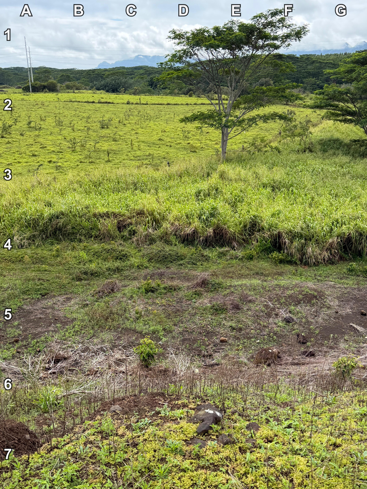
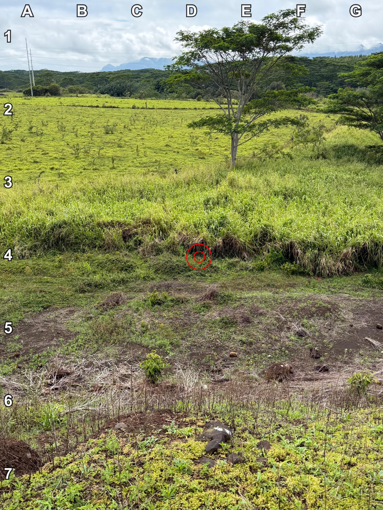

+++
title = '🔎 #112 - Phreaky Pheasant 🦤'
date = 2026-04-19
draft = false
expiryDate = 2026-07-18
tags = [
'HARD',
]
+++
<!--more-->

### ❓Hints
{}
- the bird is a pheasant
- it has a red head
- it's fairly small in the photo
{}
### 🎯 Location
{}
{}

{}
{}