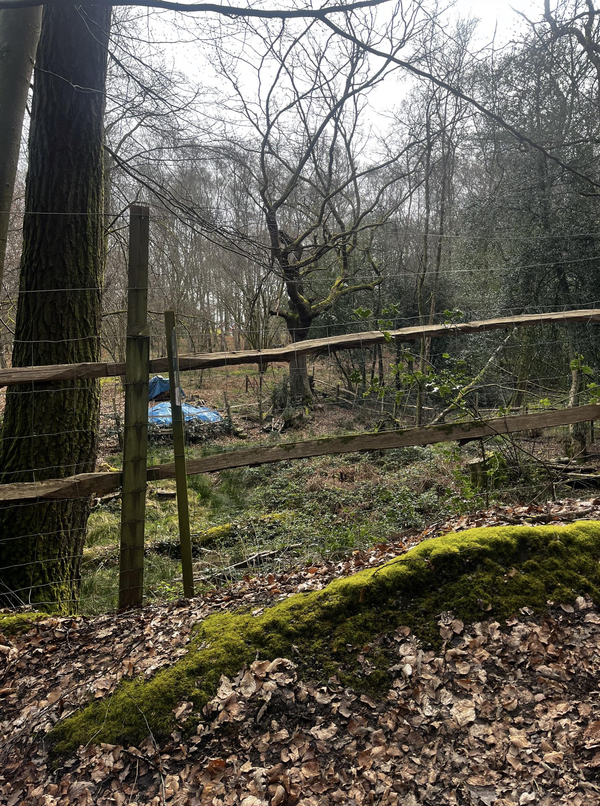

+++
title = '🔎 #121 - Oh deer 🦌'
date = 2026-04-28
draft = false
tags = [
'HARD',
]
+++
<!--more-->

### ❓Hints
{}
- the deer is dark colored
{}
### 🎯 Location
{}
🗓️ The location for this object will be posted tomorrow -- See you then!
{}