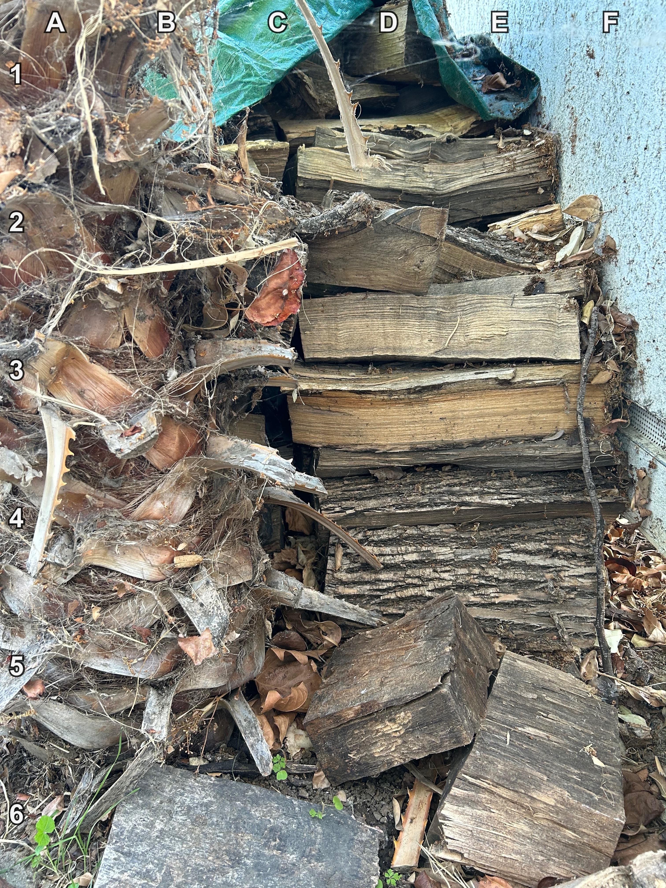
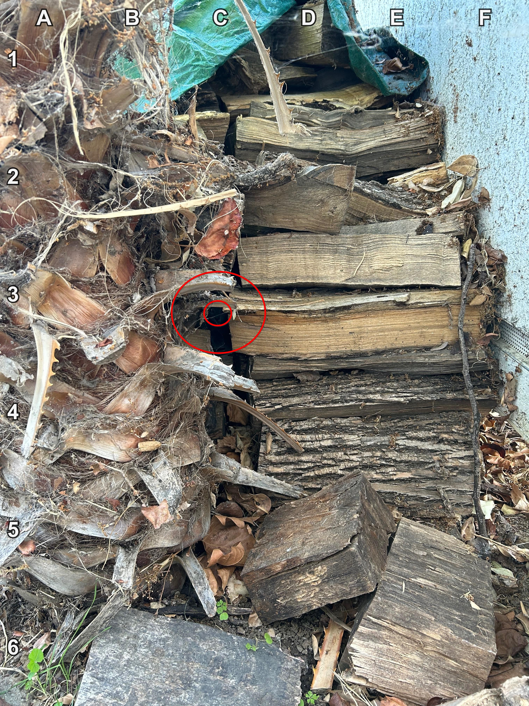

+++
title = '🔎 #122 - Lumber Cat 🐈🪵'
date = 2026-04-29
draft = false
expiryDate = 2026-07-28
tags = [
'HARD',
]
+++
<!--more-->

There's a cat hiding here somewhere
### ❓Hints
{}
- you can only se its face
- it's kind of hard to see
{}
### 🎯 Location
{}
{}

{}
{}