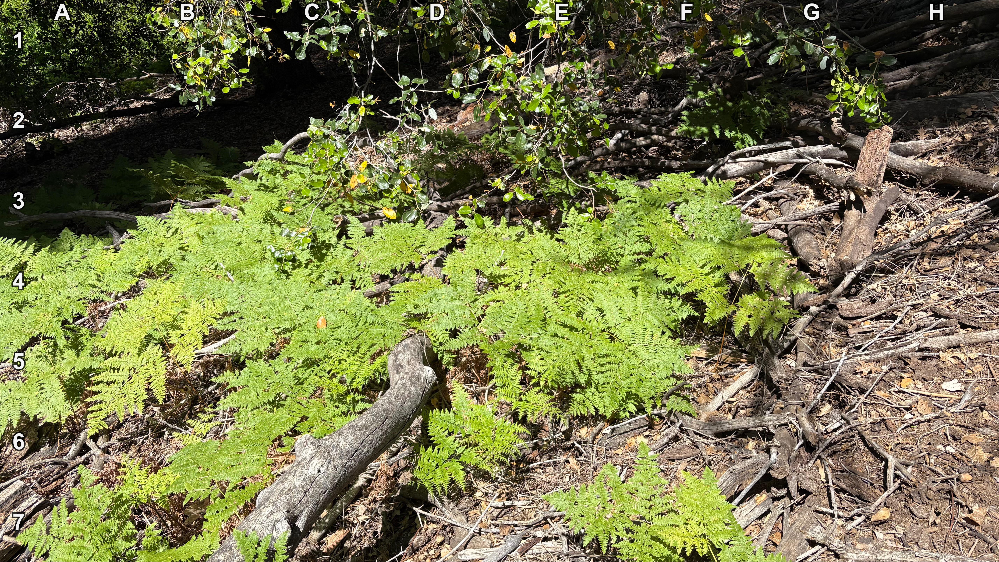
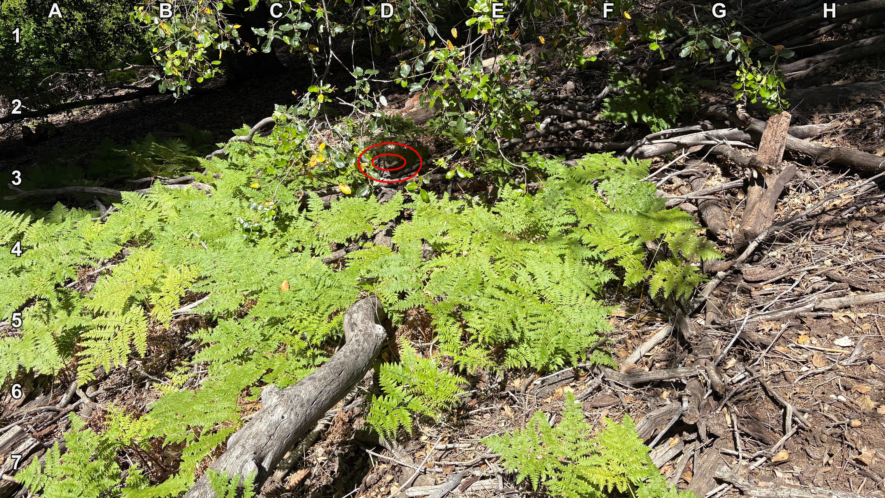

+++
title = '🔎 #146 - Monkish Munk 🐿️'
date = 2026-05-23
draft = false
expiryDate = 2026-08-21
tags = [
'HARD',
]
+++
That was a bad pun, I know...
<!--more-->

Find the chipmunk!
### 🎯 Location
{}
{}

{}
{}