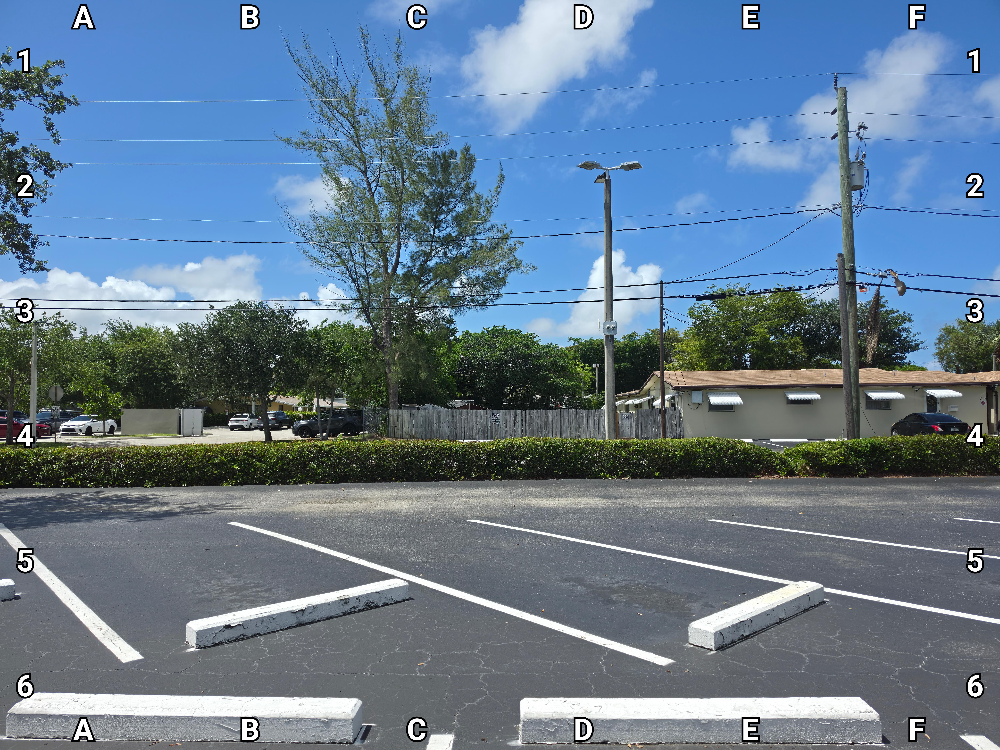

+++
title = '🔎 #148 - Blue? Jay 🐦'
date = 2026-05-25
draft = false
tags = [
'HARD',
]
+++
<!--more-->

There's a blue jay in this photo. But it's not super clear.
### ❓Hints
{}
- it's facing you
- you can't see any of its blue feathers
{}
### 🎯 Location
{}
🗓️ The location for this object will be posted tomorrow -- See you then!
{}