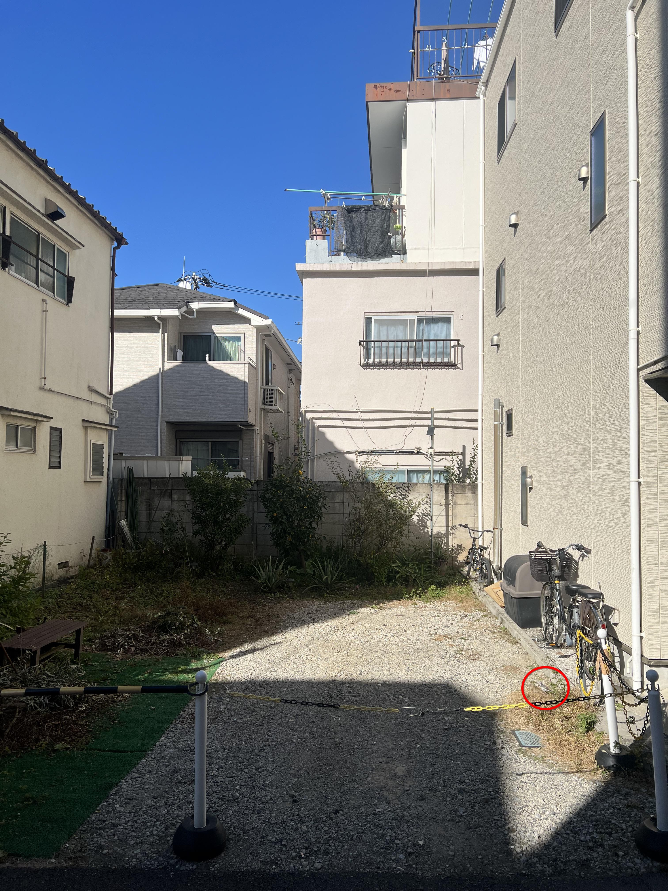

+++
title = '🔎 #16 - Japanese Wagtail 🐦‍⬛'
date = 2026-01-15
draft = false
tags = [
'medium',
]
+++
<!--more-->

### Did you know...
> Japanese wagtails are native to Japan and Korea. They commonly build nests in cavities near water, and both the female and males look after the eggs and chicks.
### ❓Hints
{}
- it’s grey and white
{}
### 🎯 Location
{}
{}

{}
{}