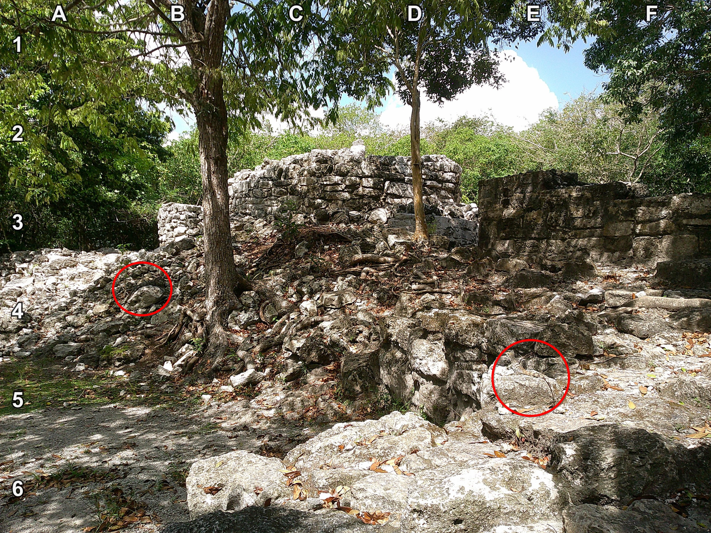

+++
title = '🔎 #168 - Iguana Duo 🦎🦎'
date = 2026-06-14
draft = false
tags = [
'MEDIUM',
]
+++
<!--more-->

There are two iguanas sunbathing on these rocks!
### ❓Hints
{}
- they're not near each other
{}
### 🎯 Location
{}
{}

{}
{}