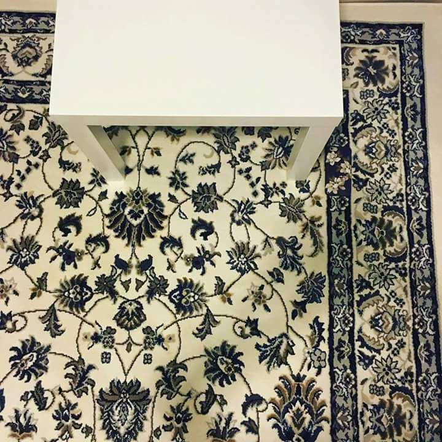

+++
title = '🔎 #17 - Phone (lost in) home 📱'
date = 2026-01-16
draft = false
expiryDate = 2026-04-16
tags = [
'medium',
]
+++
<!--more-->

### ❓Hints
{}
- the phone is in a case
{}
### 🎯 Location
{}
{}

{}
{}