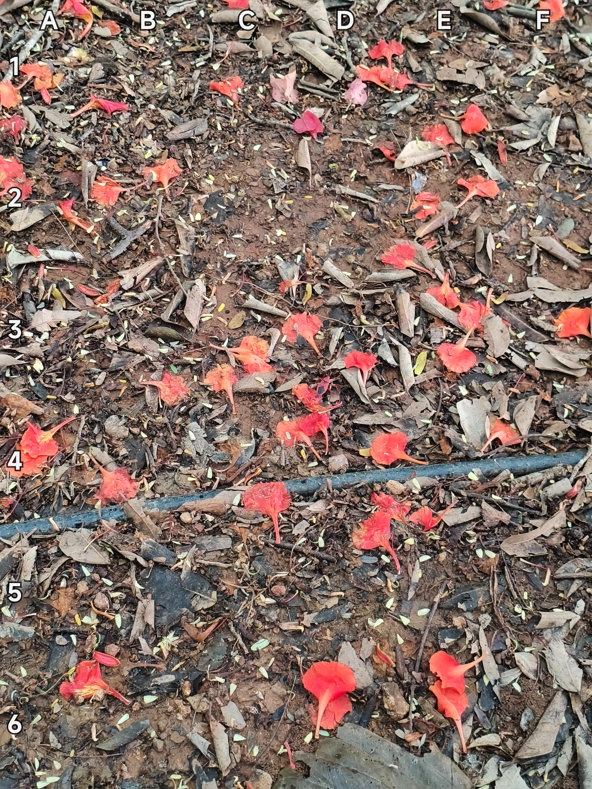

+++
title = '🔎 #188 - Bug in the mud 🪲'
date = 2026-07-04
draft = false
expiryDate = 2026-10-02
tags = [
'HARD',
]
+++
<!--more-->

There's a bug in this mud
### ❓Hints
{}
- the bug has a black spot
{}
### 🎯 Location
{}
🗓️ The location for this object will be posted tomorrow -- See you then!
{}