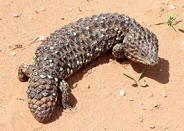
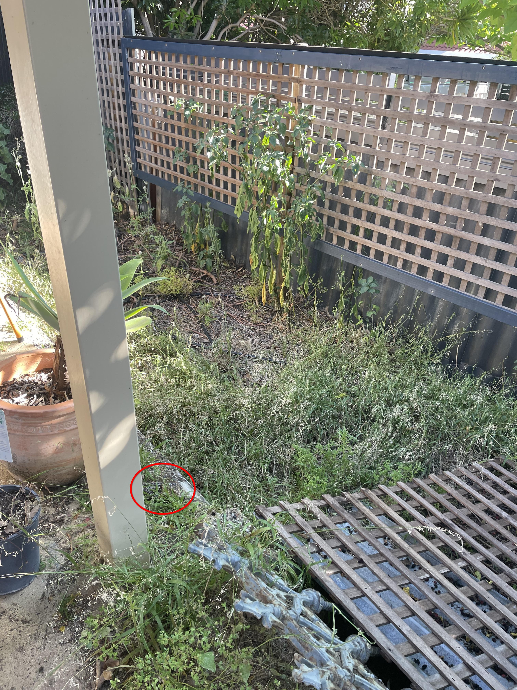

+++
title = '🔎 #19 - Bobtail lizard 🦎'
date = 2026-01-18
draft = false
tags = [
'medium',
]
+++
<!--more-->

### Did you know...
> Tiliqua rugosa, commonly known as the bobtail lizard, is a short-tailed, slow-moving species of blue-tongued skink endemic to Australia.
### ❓Hints
{}
- you can only see the front half of it
{}
### 🎯 Location
{}
{}

{}
{}