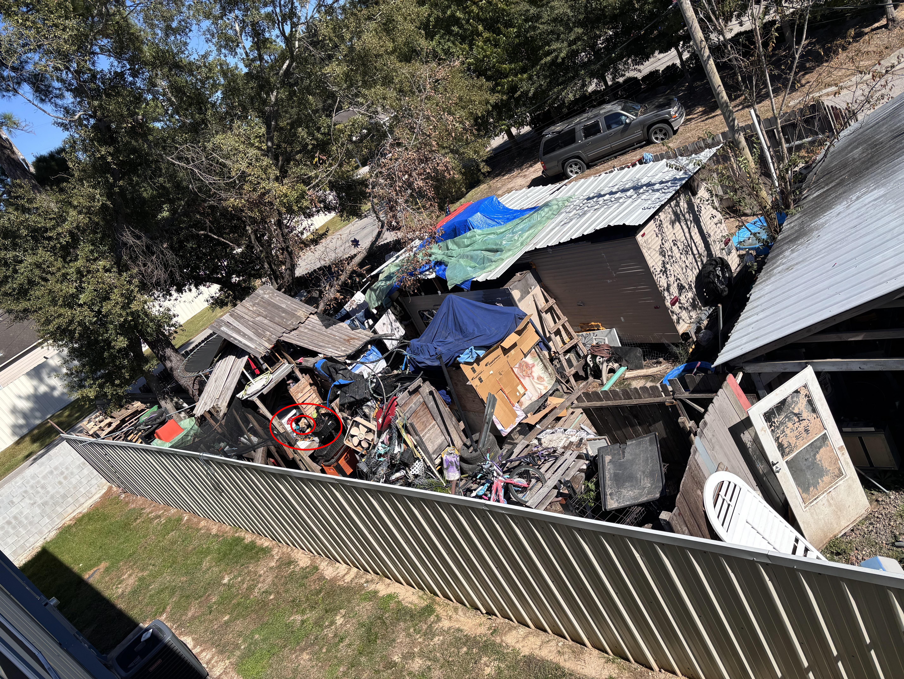

+++
title = '🔎 #21 -  Find the dog! 🐶'
date = 2026-01-20
draft = false
expiryDate = 2026-04-20
tags = [
'hard',
]
+++
<!--more-->

### ❓Hints
{}
- you can only see the dog’s head
{}
### 🎯 Location
{}
{}

{}
{}