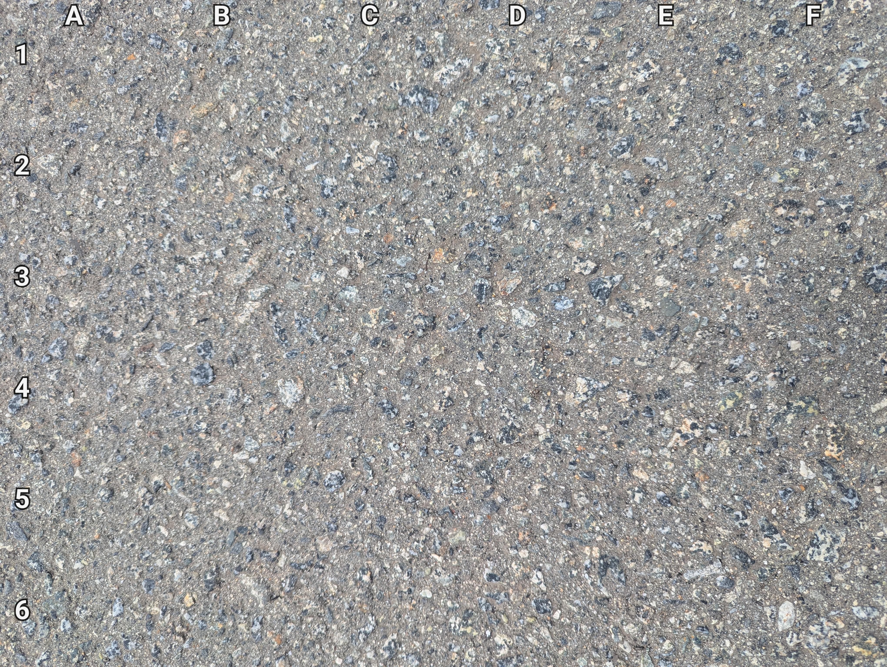
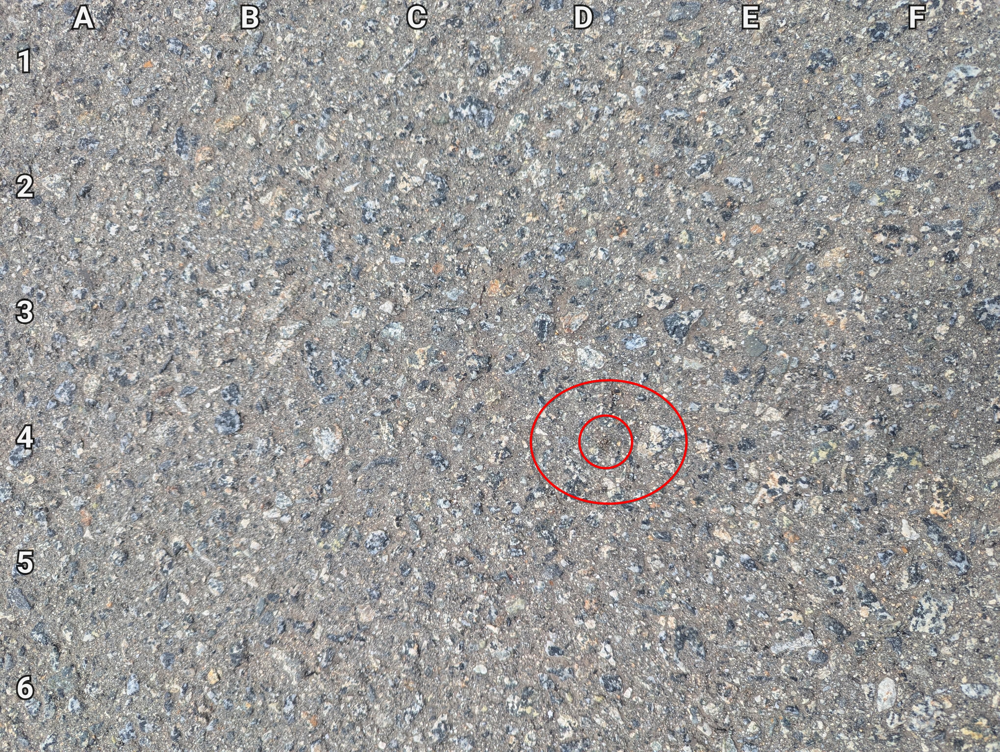

+++
title = '🔎 #221 - Jumping Jack 🕷️'
date = 2026-08-04
draft = false
expiryDate = 2026-11-02
tags = [
'MEDIUM',
]
+++
I'm assuming the spider's name is Jack
<!--more-->

Find the jumping spider!
### 🎯 Location
{}
{}

{}
{}