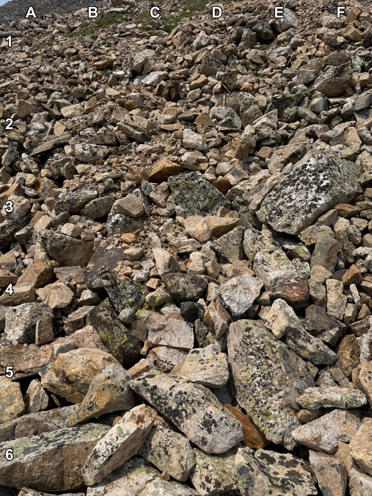
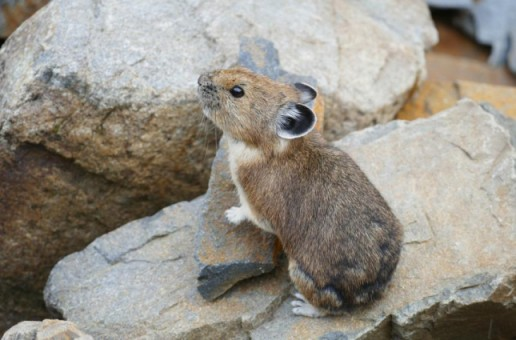

+++
title = '🔎 #232 - Peeking Pika 🐹'
date = 2026-08-15
draft = false
expiryDate = 2026-11-13
tags = [
'HARD',
]
+++
<!--more-->

### Pika
 A pika is a small, mountain-dwelling mammal native to Asia and North America. With short limbs, a very round body, an even coat of fur, and no external tail, they resemble their close relative the rabbit, but with short, rounded ears.
### 🎯 Location
{}
🗓️ The location for this object will be posted tomorrow -- See you then!
{}