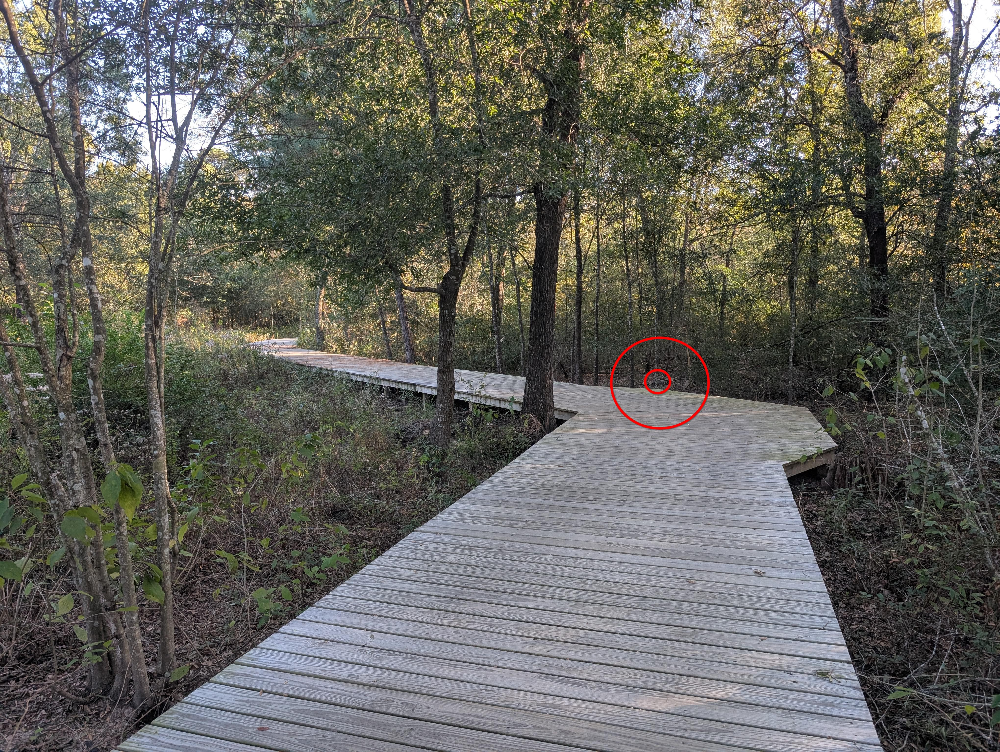

+++
title = '🔎 #24 - Armadillo on the move 🏜'
date = 2026-01-23
draft = false
expiryDate = 2026-04-23
tags = [
'hard',
]
+++
<!--more-->

### Fun Fact
> Armadillos are among the few known species that can contract leprosy systemically. They are particularly susceptible due to their unusually low body temperature, which is hospitable to the leprosy bacterium. 
### ❓Hints
{}
- ↪🪾
{}
### 🎯 Location
{}
{}

{}
{}