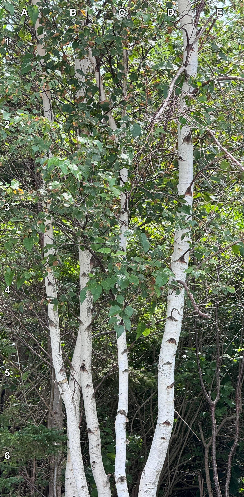
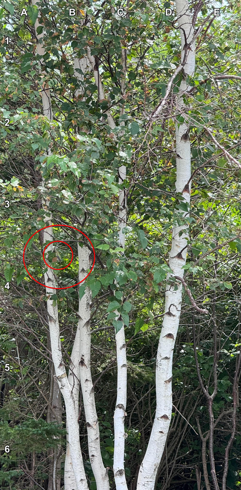

+++
title = '🔎 #247 - Hmmmmmmmmmming bird 🐦'
date = 2026-08-30
draft = false
expiryDate = 2026-11-28
tags = [
'HARD',
]
+++
<!--more-->

Find the hummingbird!
### ❓Hints
{}
- it's a bit blurry, but it's there
- it's green
- it's facing to the left
- you can clearly see its body, but it's hard to see its head
{}
### 🎯 Location
{}
{}

{}
{}