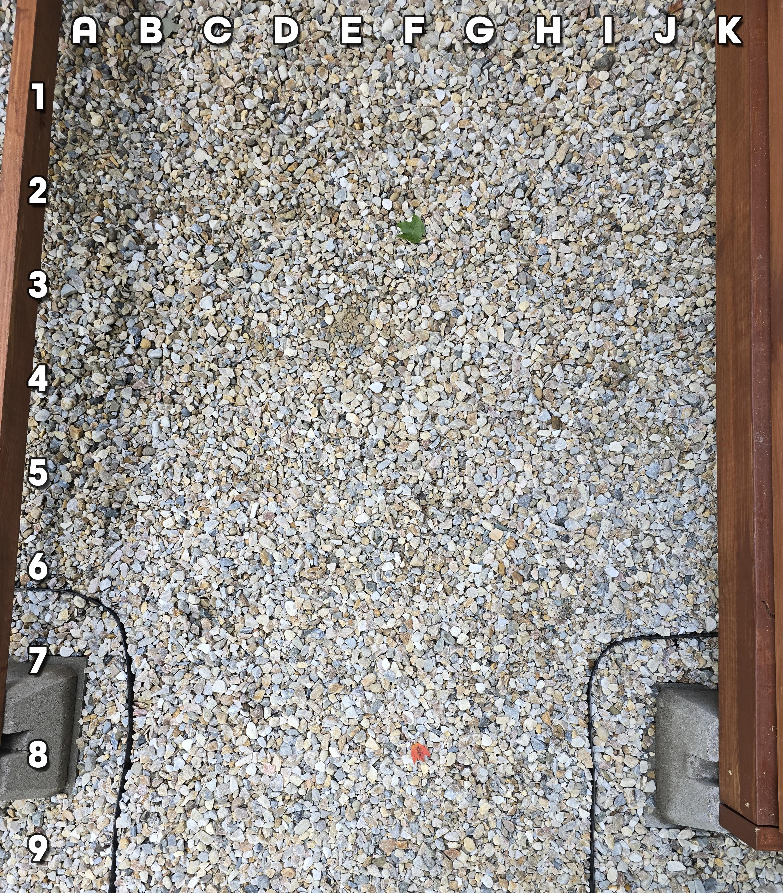

+++
title = '🔎 #248 - Screw this deck 🪛'
date = 2026-08-31
draft = false
expiryDate = 2026-11-29
tags = [
'HARD',
]
+++
...no really, this deck needs more screws
<!--more-->

Find the screw that someone dropped!
### ❓Hints
{}
- it's long and silver
{}
### 🎯 Location
{}
🗓️ The location for this object will be posted tomorrow -- See you then!
{}