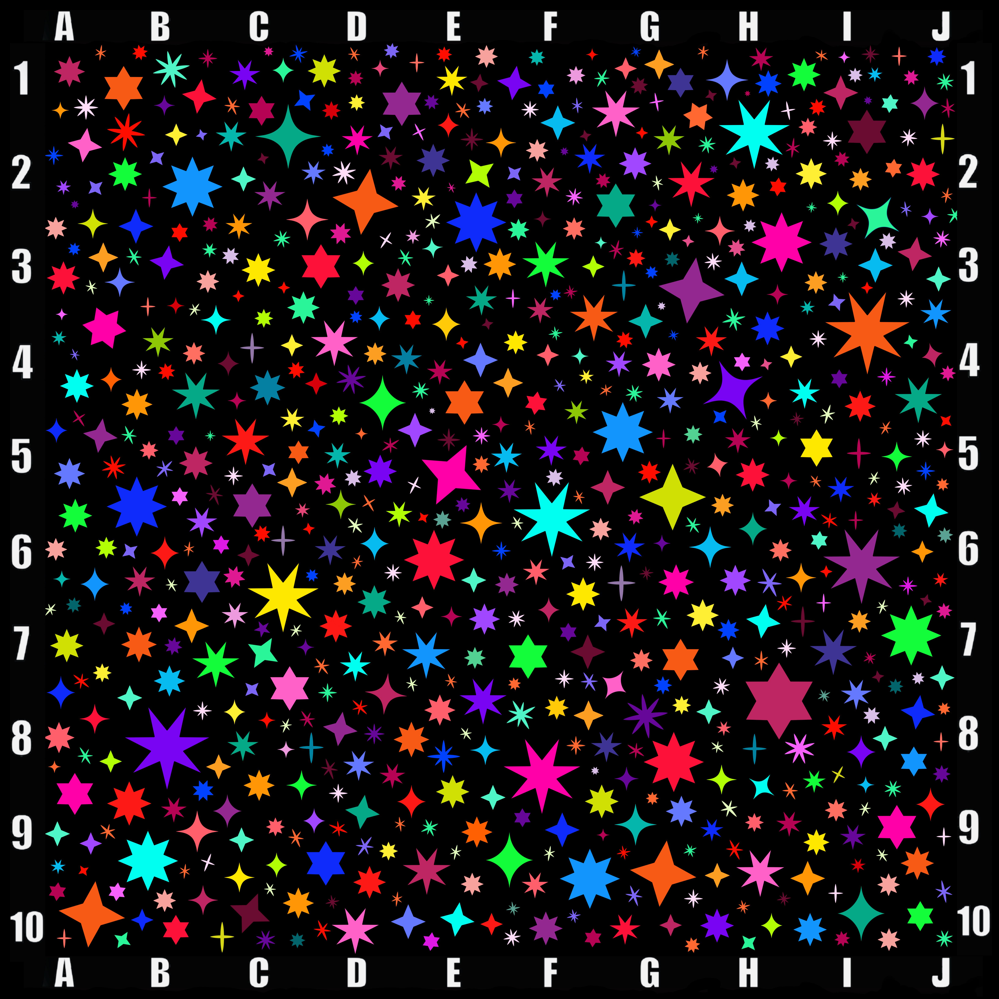
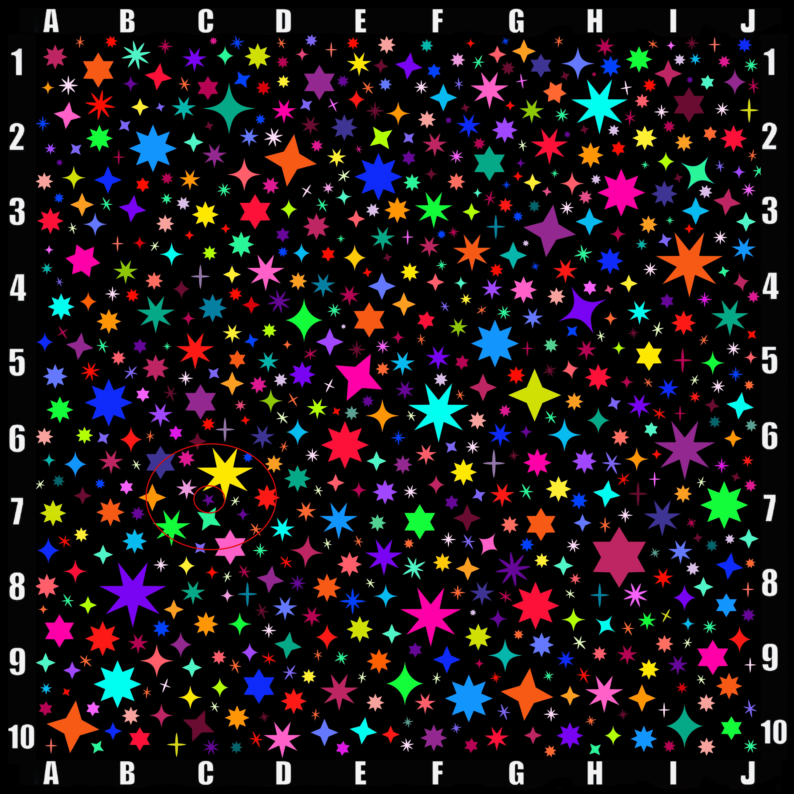

+++
title = '🔎 #264 - Seeing Stars ⭐'
date = 2026-09-15
draft = false
expiryDate = 2026-12-14
tags = [
'HARD',
]
+++
<!--more-->

Find the star with exactly 5 points. Like this one: ⭐
### 🎯 Location
{}
{}

{}
{}