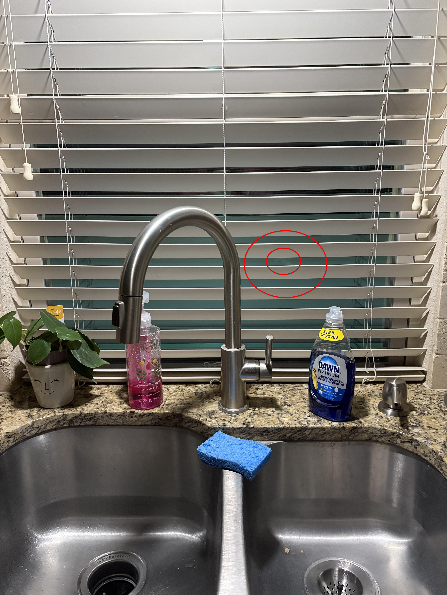

+++
title = '🔎 #276 - Kitchen Lizard 🦎'
date = 2026-09-27
draft = false
expiryDate = 2026-12-26
tags = [
'MEDIUM',
]
+++
<!--more-->

Find the lizard!
### ❓Hints
{}
- you can't see the whole lizard
{}
### 🎯 Location
{}
{}

{}
{}