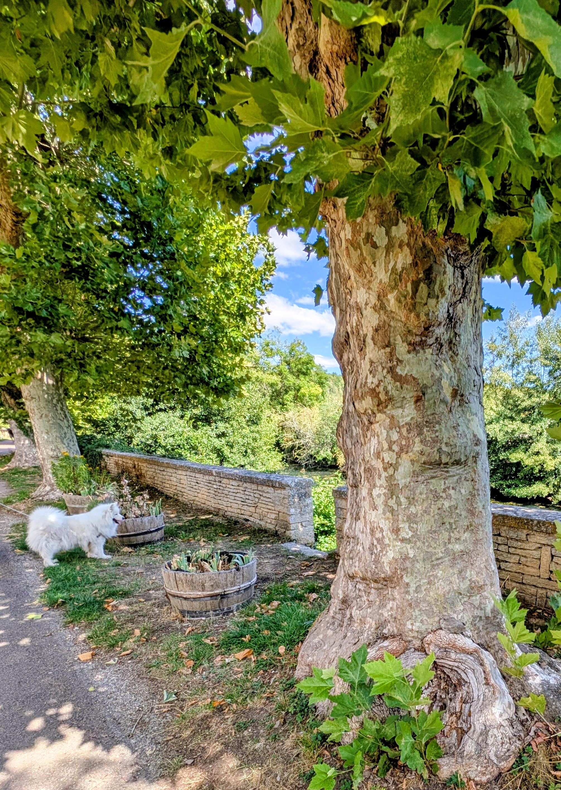

+++
title = '🔎 #277 - Countryside Bird 🐦‍⬛'
date = 2026-09-28
draft = false
expiryDate = 2026-12-27
tags = [
'HARD',
]
+++
<!--more-->

Find the bird!
### ❓Hints
{}
- it's not black
{}
### 🎯 Location
{}
🗓️ The location for this object will be posted tomorrow -- See you then!
{}