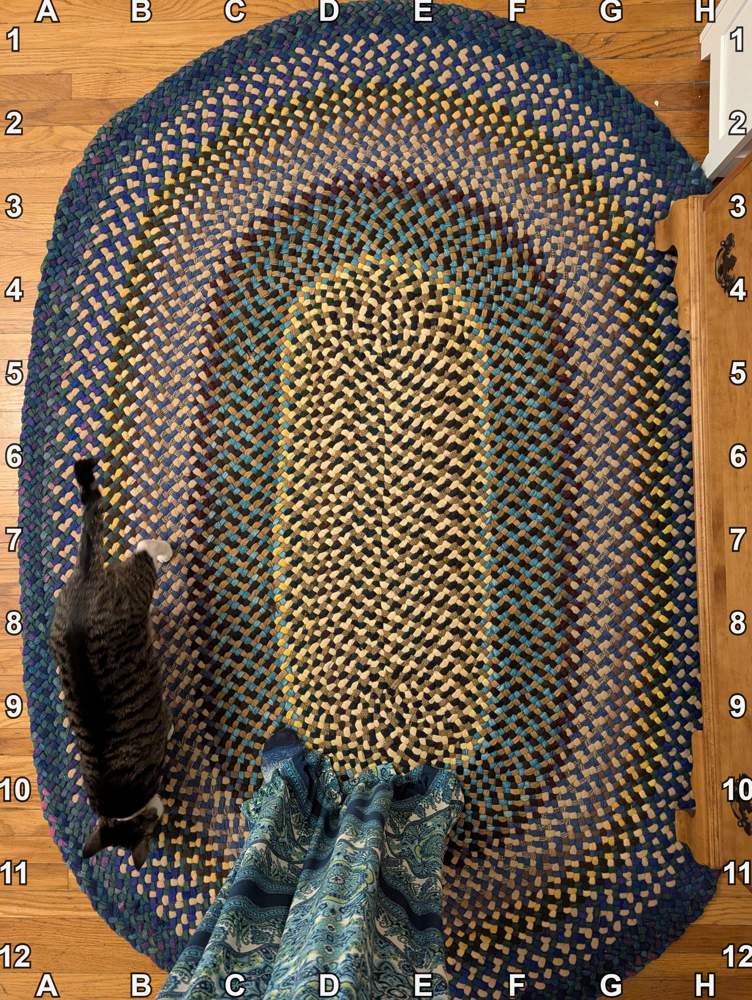

+++
title = '🔎 #280 - Missing Treat 😻🍩'
date = 2026-10-01
draft = false
expiryDate = 2026-12-30
tags = [
'HARD',
]
+++
<!--more-->

Someone dropped a cat treat!
### ❓Hints
{}
- it's brown
- it looks like a single piece of dog kibble
- it's roundish
{}
### 🎯 Location
{}
🗓️ The location for this object will be posted tomorrow -- See you then!
{}