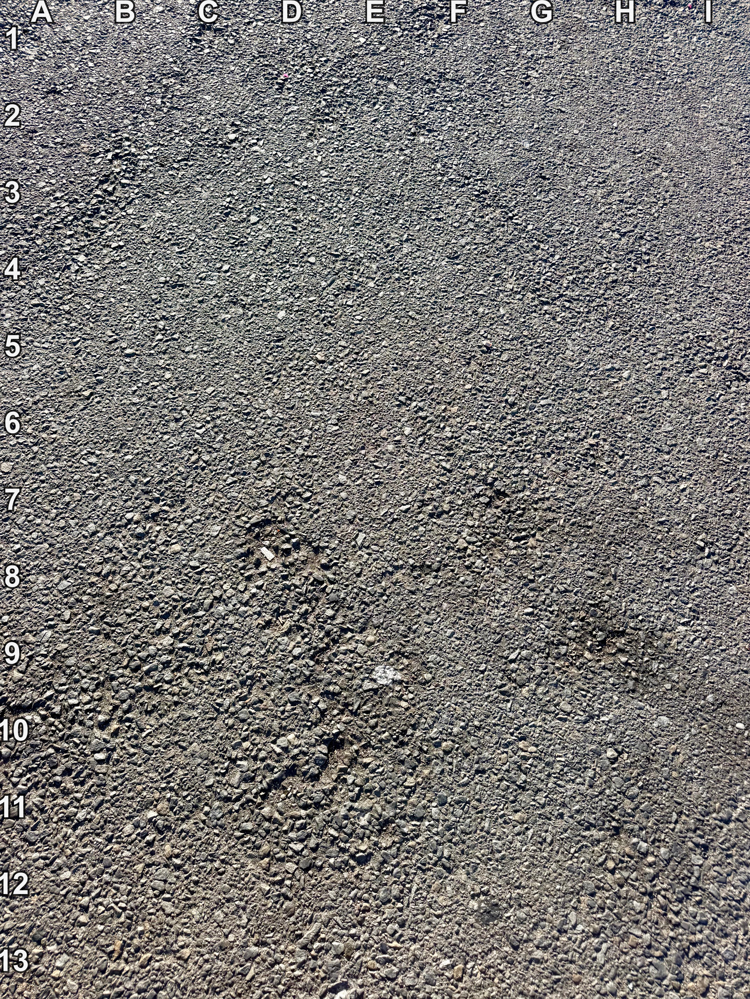
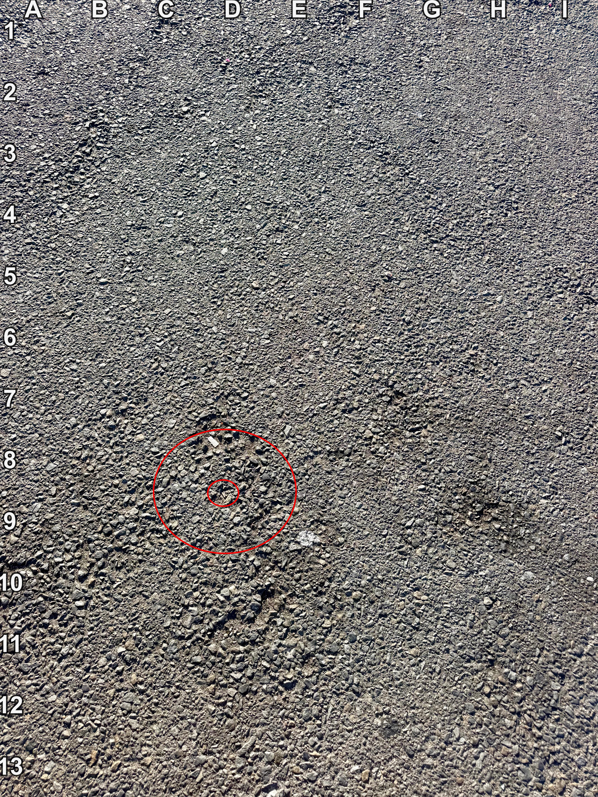

+++
title = '🔎 #286 - oK'
date = 2026-10-07
draft = false
expiryDate = 2027-01-05
tags = [
'IMPOSSIBLE',
]
+++
<!--more-->

Someone dropped a _tiny_ letter K in the parking lot. Can you find it?
### ❓Hints
{}
- it's right-side up, so it's the same orientation as "k"
- it's tiny!
{}
### 🎯 Location
{}
{}

{}
{}