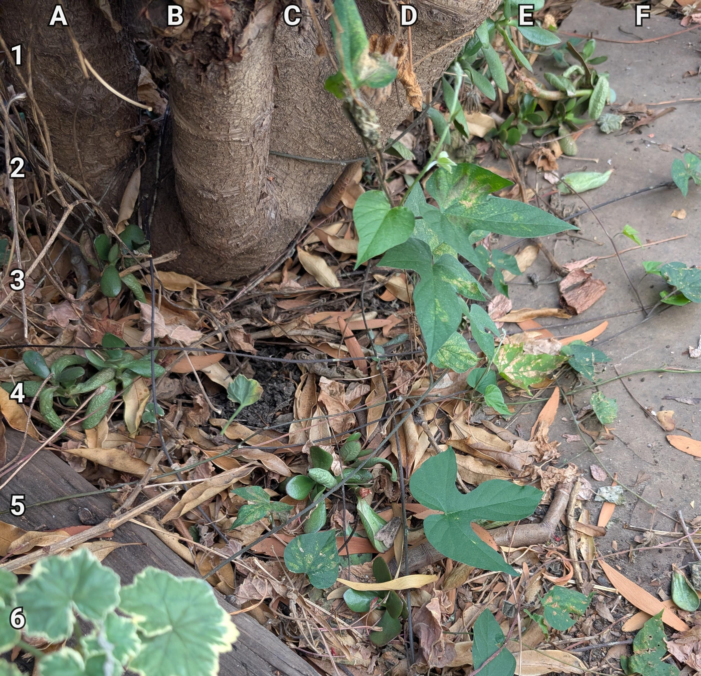
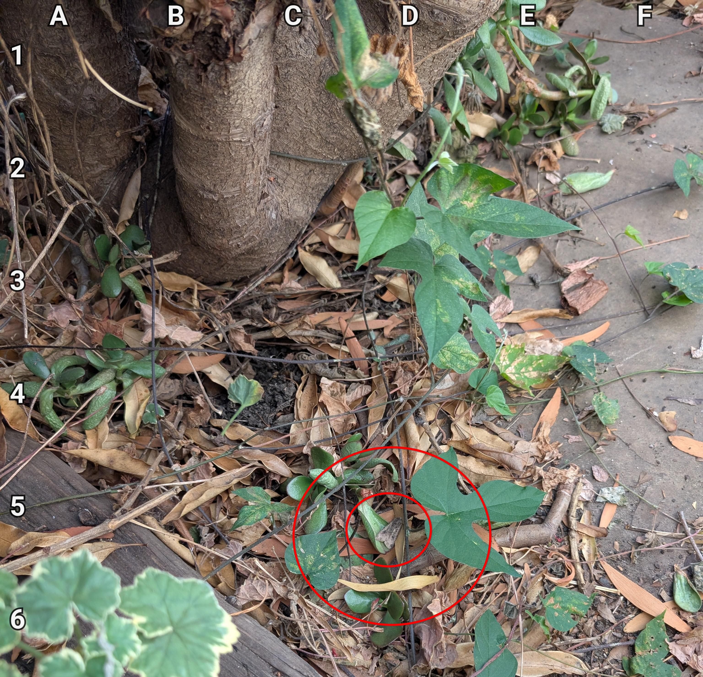

+++
title = '🔎 #287 - Moth of the month 🦋'
date = 2026-10-08
draft = false
expiryDate = 2027-01-06
tags = [
'IMPOSSIBLE',
]
+++
<!--more-->

Find the moth!
### ❓Hints
{}
- you won't be able to find the moth!
- you still won't be able to find the moth!
{}
### 🎯 Location
{}
{}

{}
{}