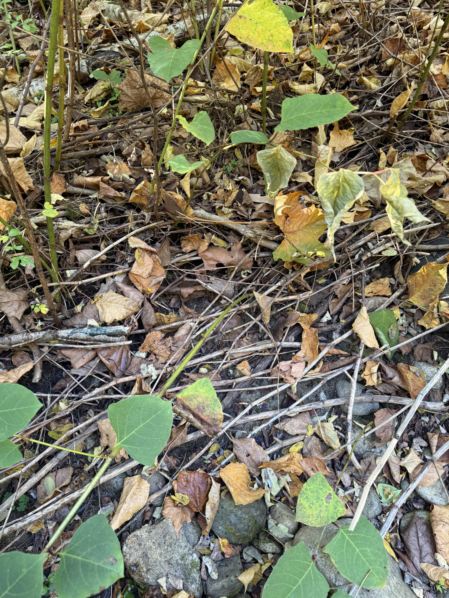
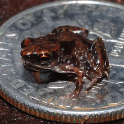
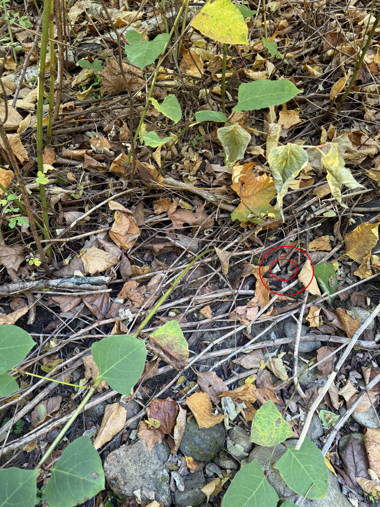

+++
title = '🔎 #36 - Unassuming Amphibian 🐸'
date = 2026-02-02
draft = false
tags = [
'hard',
]
+++
How did they even know it was there??
<!--more-->

### Did you know...
> One of the smallest frogs in the world is the Paedophryne amauensis, also known as the New Guinea Amau frog. They're native to eastern Papua New Guinea and are a mere 0.3in (7.7mm) in length 
### ❓Hints
{}
- 🎯
{}
### 🎯 Location
{}
{}

{}
{}