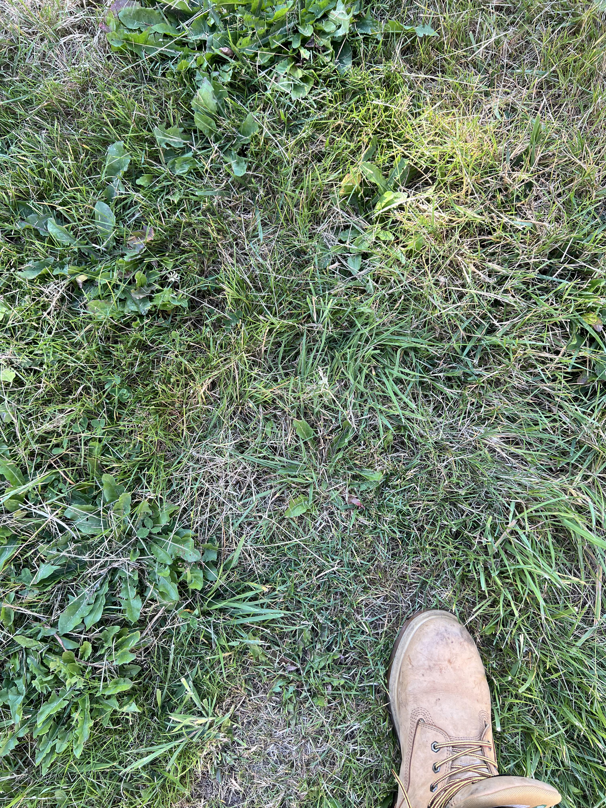
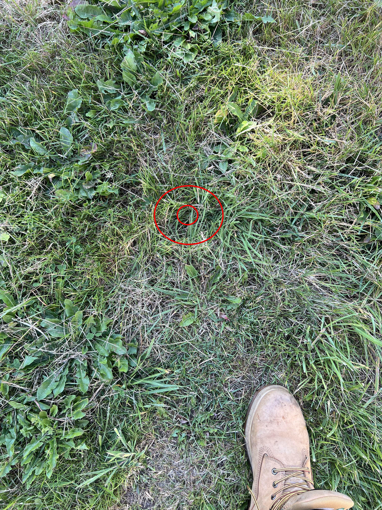

+++
title = '🔎 #37 - Hidden Hopper 🐸'
date = 2026-02-03
draft = false
tags = [
'HARD',
]
+++
Very _croak and dagger_, this one...
<!--more-->

### Did you know...
> It's not uncommon for a frog tadpole to develop extra legs after being infected by a parasitic flatworm
### ❓Hints
{}
- the frog is the same shade of green as the grass. just what you wanted to hear, right?!
{}
### 🎯 Location
{}
{}

{}
{}