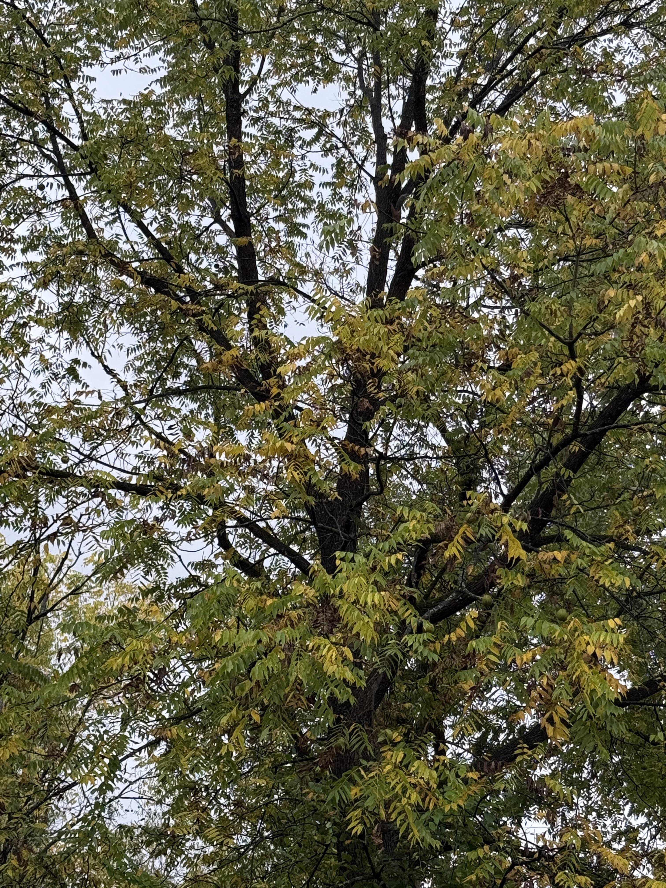

+++
title = '🔎 #44 - Tree rat-tat-tat 🐿️'
date = 2026-02-10
draft = false
tags = [
'MEDIUM',
]
+++
<!--more-->

### ❓Hints
{}
- ↗️
{}
### 🎯 Location
{}
🗓️ The location for this object will be posted tomorrow -- See you then!
{}