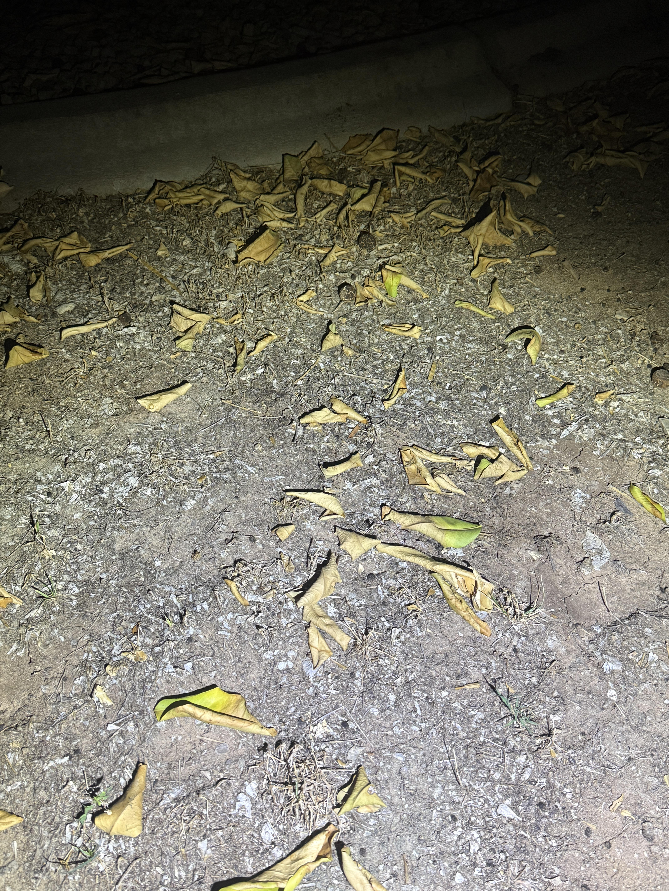
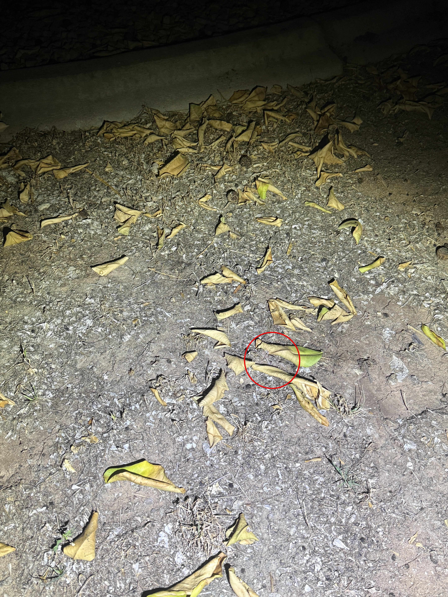

+++
title = '🔎 #45 - Lackadaisical Lizard 🦎'
date = 2026-02-11
draft = false
tags = [
'MEDIUM',
]
+++
I had to look up how to spell "lackadaisical"...
<!--more-->

### Definition...
> **lackadaisical**: Lacking life, spirit, or zest
### ❓Hints
{}
- it's the same color as the dirt!
{}
### 🎯 Location
{}
{}

{}
{}