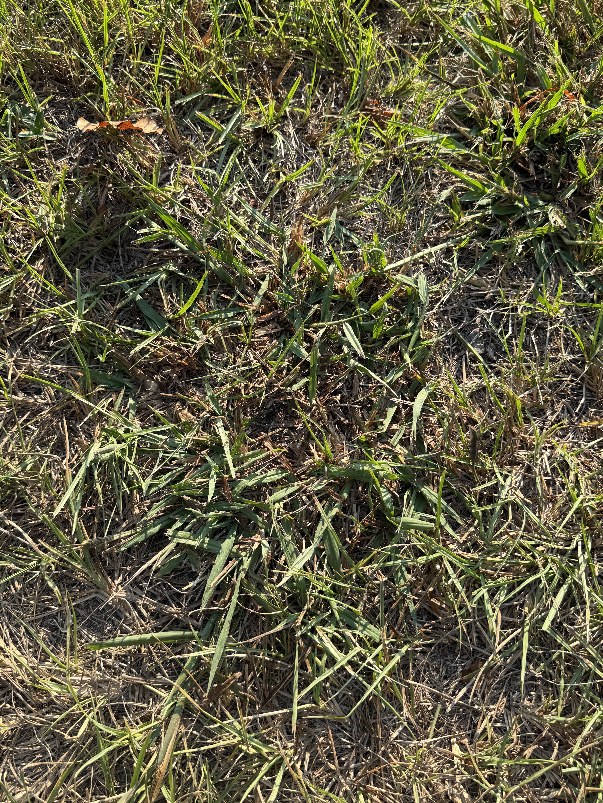
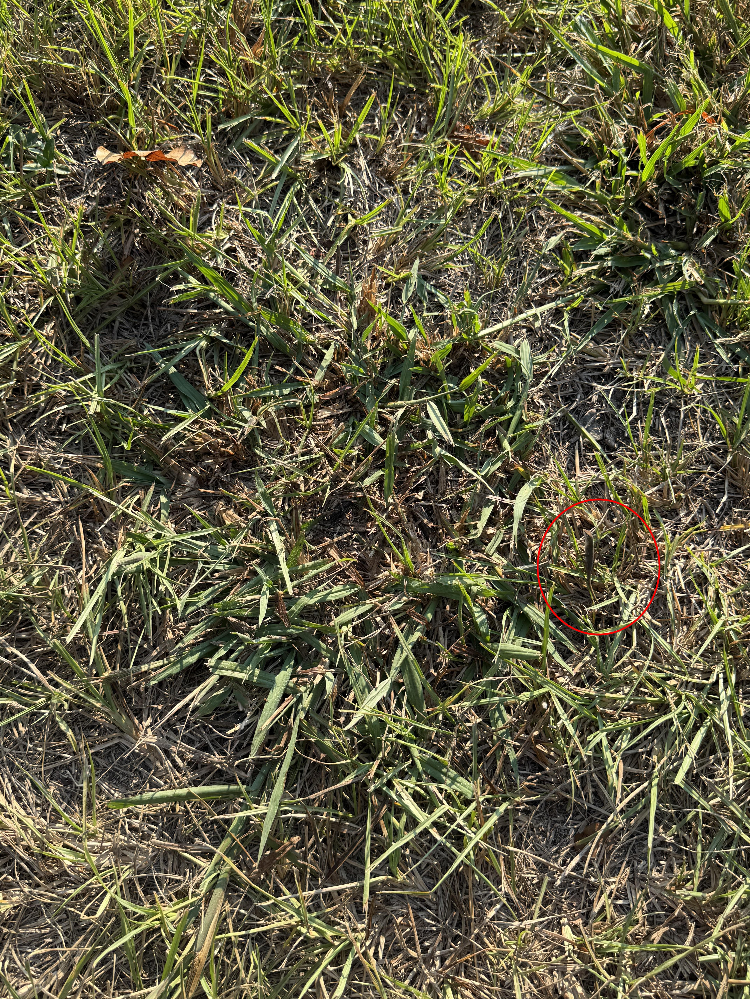

+++
title = '🔎 #46 - Sly Skink 🦎'
date = 2026-02-12
draft = false
expiryDate = 2026-05-13
tags = [
'MEDIUM',
]
+++
Say "skink" 10 times in a row and tell me it doesn't sound like a fake word...
<!--more-->

### Did you know...
> Skink is one of the most diverse families of lizards. Most skinks have detachable tails that can be shed, then regrown, if grabbed by a predator.
### 🎯 Location
{}
{}

{}
{}