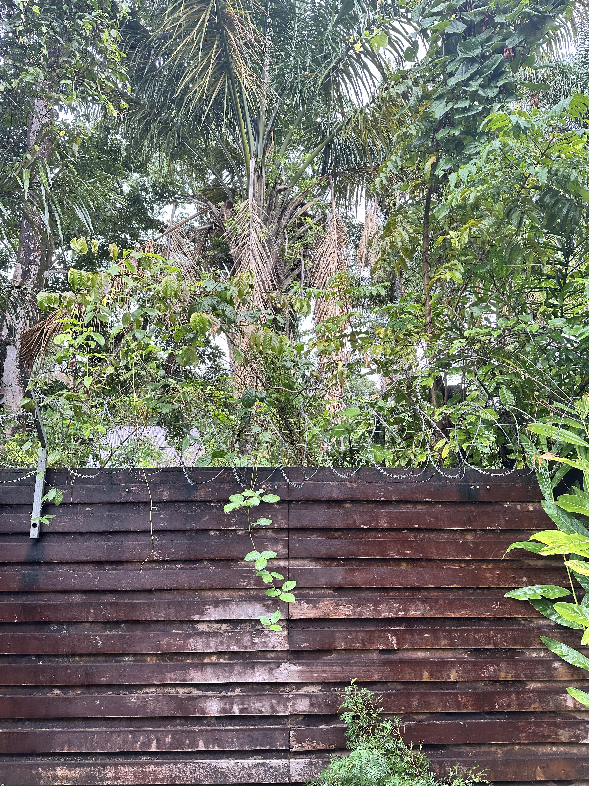

+++
title = '🔎 #56 - Ssssssssnake! 🐍'
date = 2026-02-22
draft = false
tags = [
'EASY',
]
+++
I didn't know they could do that...
<!--more-->

### ❓Hints
{}
- it's horizontal
- it's brown
{}
### 🎯 Location
{}
🗓️ The location for this object will be posted tomorrow -- See you then!
{}