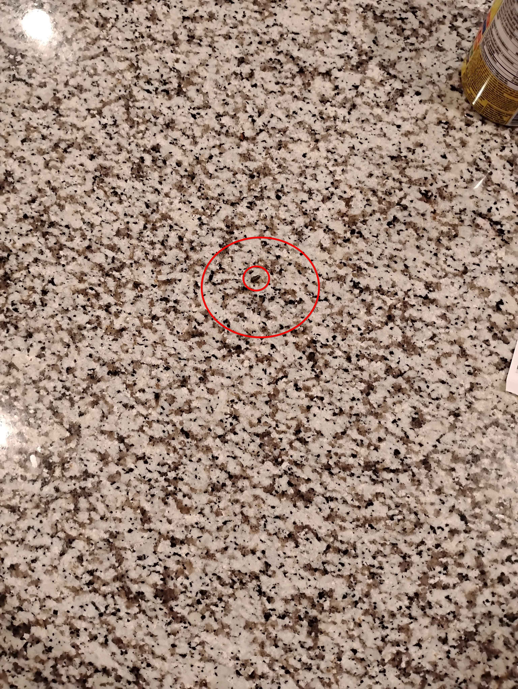

+++
title = '🔎 #6 - Snail 🐌'
date = 2026-01-06
draft = false
expiryDate = 2026-04-06
tags = [
'hard',
]
+++
<!--more-->

It's hard to tell it's a snail, but it's there.
### ❓Hints
{}
- looks like a mouse turd. 💩
{}
### 🎯 Location
{}
{}

{}
{}