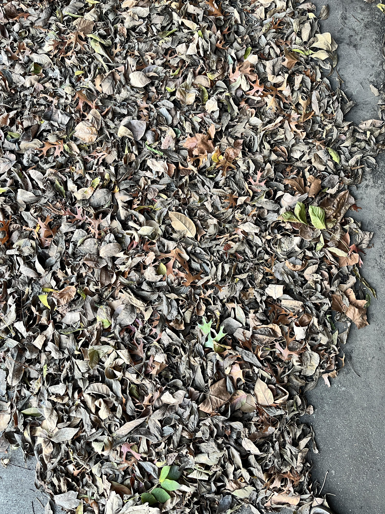

+++
title = '🔎 #65 - Retired Roach 🪳'
date = 2026-03-03
draft = false
tags = [
'HARD',
]
+++
dedbug
<!--more-->

### ❓Hints
{}
- it's a wood roach
- it's black
- it's upside down
- it's dead
- it's not super clear, so if you think you found it, you probably did
{}
### 🎯 Location
{}
🗓️ The location for this object will be posted tomorrow -- See you then!
{}