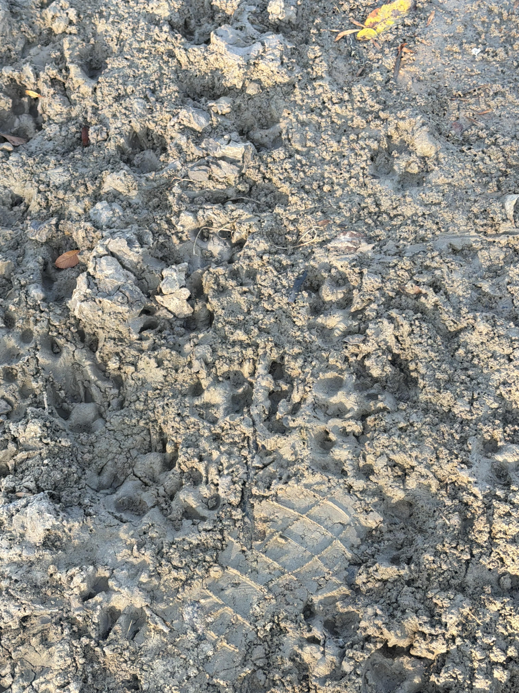
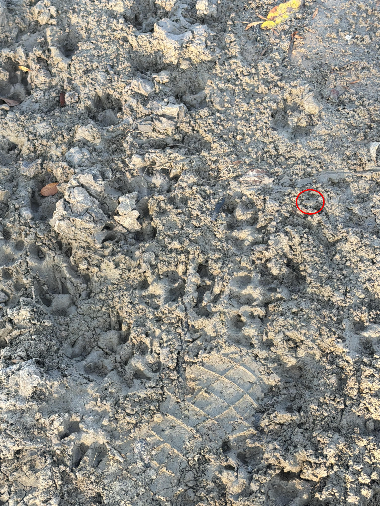

+++
title = '🔎 #70 - Frog, you say? 🐸'
date = 2026-03-08
draft = false
tags = [
'HARD',
]
+++
<!--more-->

### ❓Hints
{}
- the frog is the same color as the mud. just what you wanted to hear, right?
- it's facing to the left
{}
### 🎯 Location
{}
{}

{}
{}