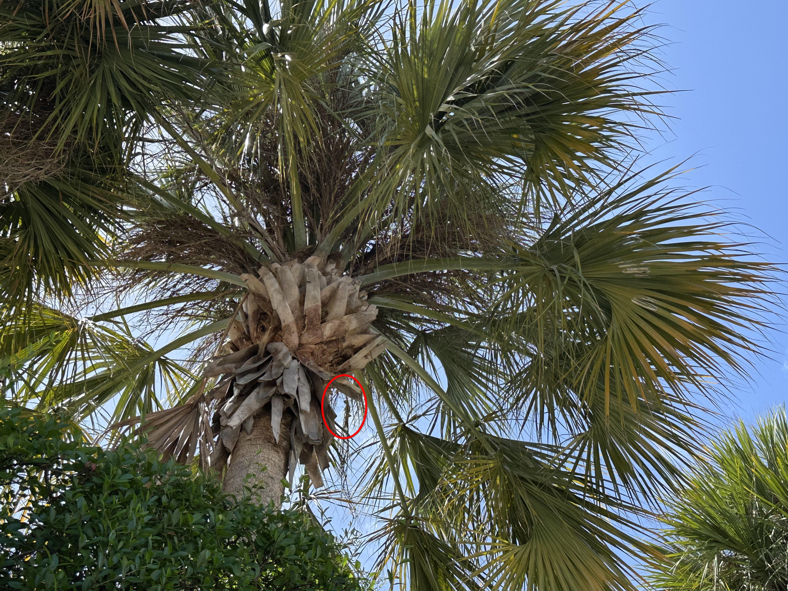

+++
title = '🔎 #75 - Indignant Iguana 🦎'
date = 2026-03-13
draft = false
tags = [
'EASY',
]
+++
<!--more-->

### ❓Hints
{}
- you can only see its belly
- it's behind a branch
{}
### 🎯 Location
{}
{}

{}
{}