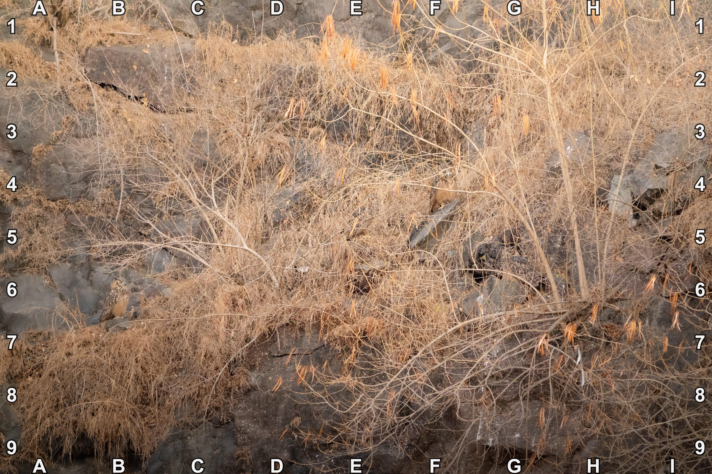
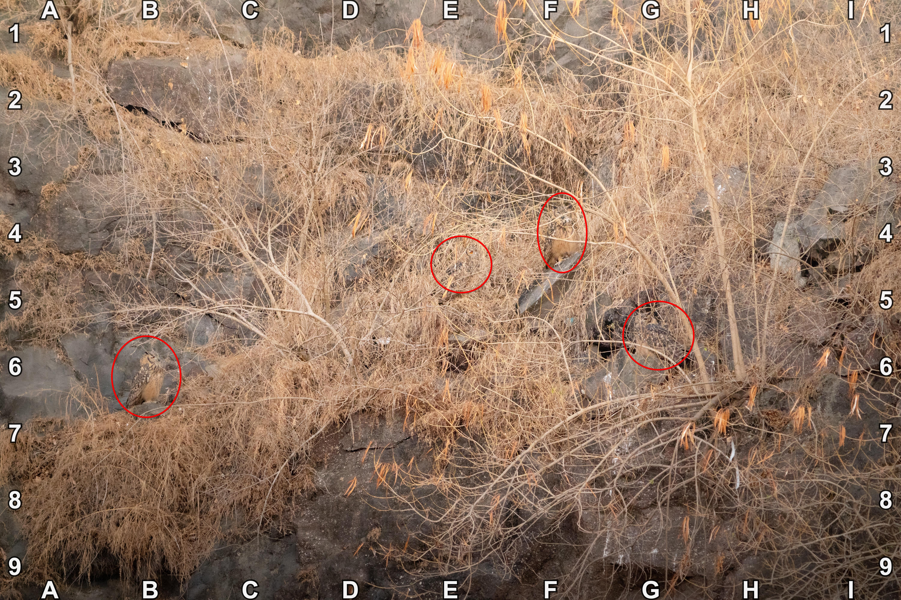

+++
title = '🔎 #90 - Parliament Peek-a-boo 🦉🦉🦉🦉'
date = 2026-03-28
draft = false
expiryDate = 2026-06-26
tags = [
'EASY',
]
+++
<!--more-->

### Did you know...
A group of owls is called a _parliament_
### ❓Hints
{}
- there are 4 owls
{}
### 🎯 Location
{}
{}

{}
{}