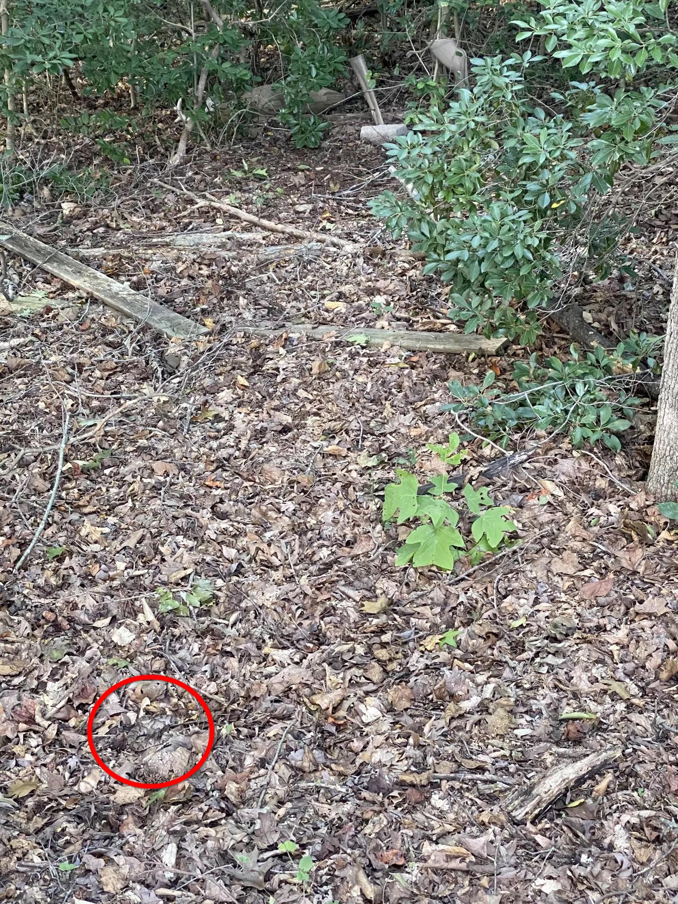

+++
title = '#13'
date = 2026-01-13T00:00:00-05:00
draft = false
+++
## 🔎 Give up and call the locksmith 🗝️
<!--more-->

<b>

<!-- description -->
There is a small key in here somewhere, I promise.
<!-- /description -->

---

  

    ❓ Hints
  

<!-- hints -->
- it's a bronze color
- it's a skeleton-type key, not a house key or car key.
<!-- /hints -->

---

  

     🎯 Location for #12
  

  

</b>

---
