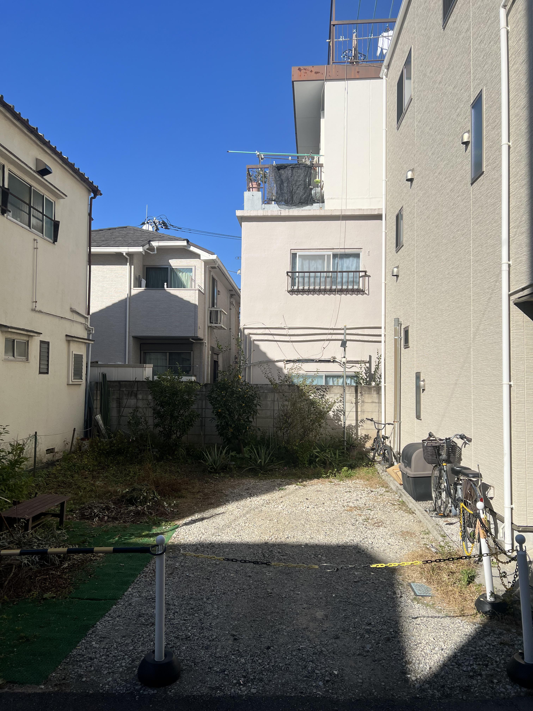
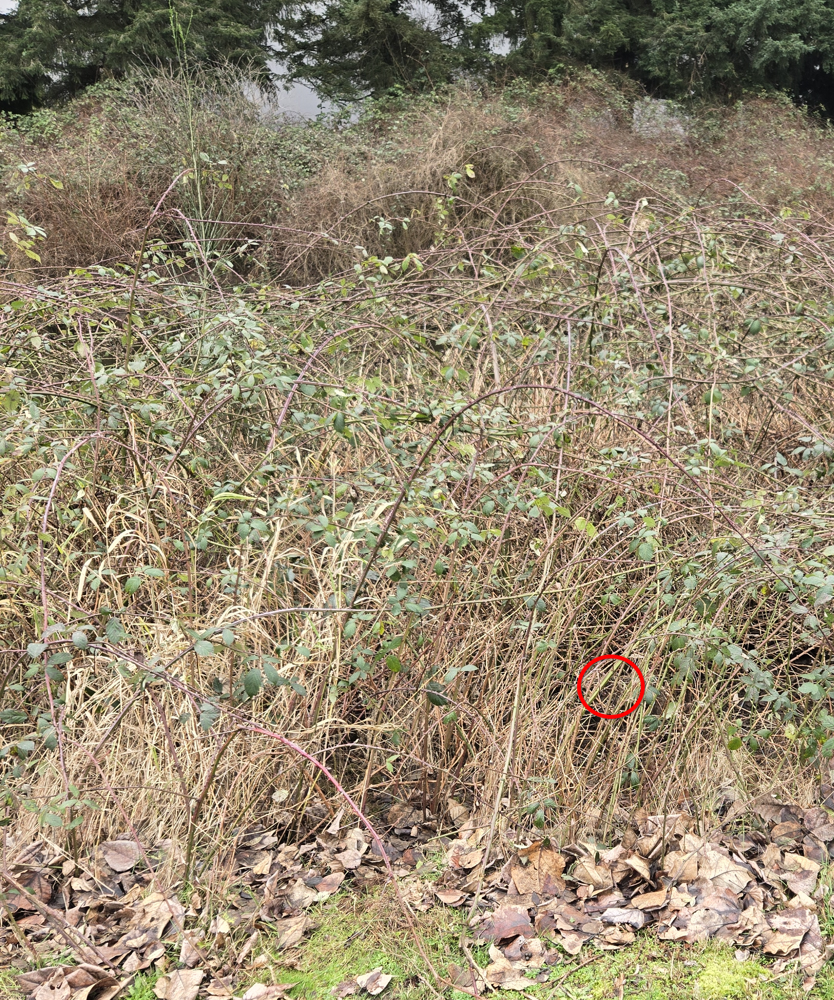

+++
title = '#15'
date = 2026-01-15T00:00:00-05:00
draft = false
+++
## 🔎 Japanese Wagtail 🐦‍⬛
<!--more-->

<b>

<!-- description -->
 Japanese wagtails are native to Japan and Korea. They commonly build nests in cavities near water, and both the female and males look after the eggs and chicks.
<!-- /description -->

---

  

    ❓ Hints
  

<!-- hints -->
- it's grey and white
<!-- /hints -->

---

  

     🎯 Location for #14
  

  

</b>

---
