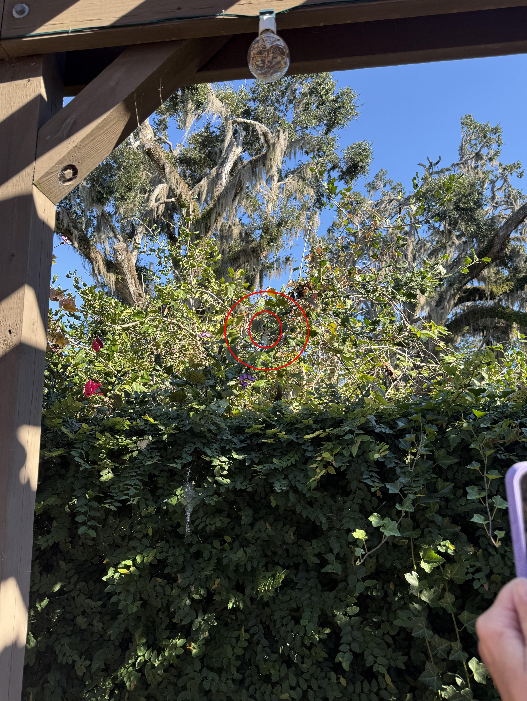
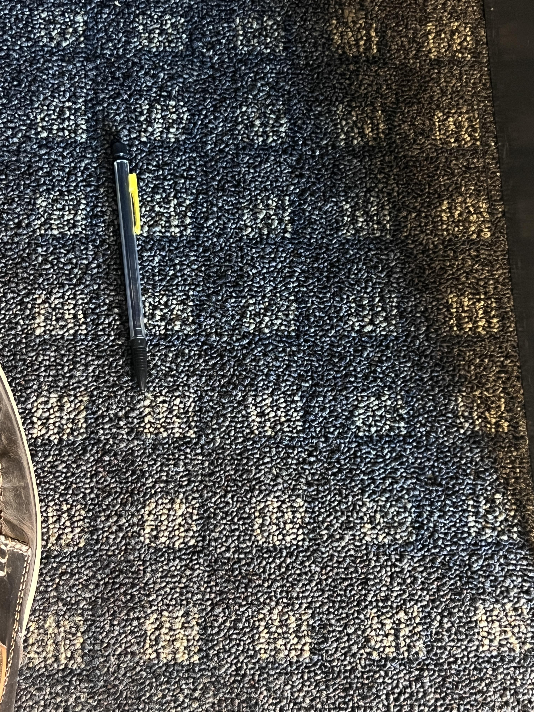

+++
title = '#18'
date = 2026-01-18T00:00:00-05:00
draft = false
+++
## 🔎 Bobtail lizard 🦎
<!--more-->

<b>

<!-- description -->
> Tiliqua rugosa, commonly known as the bobtail lizard, is a short-tailed, slow-moving species of blue-tongued skink endemic to Australia.

<!-- /description -->

---

  

    ❓ Hints
  

<!-- hints -->
- you can only see the front half of it
<!-- /hints -->

---

  

     🎯 Location for #17
  

  

</b>

---
 
 
 

# Bonus! 🎉

<b>

<!-- description -->
There is a stick of mechanical pencil lead in this picture somewhere...
<!-- /description -->
