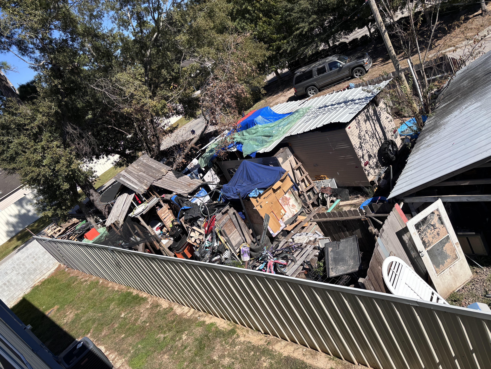
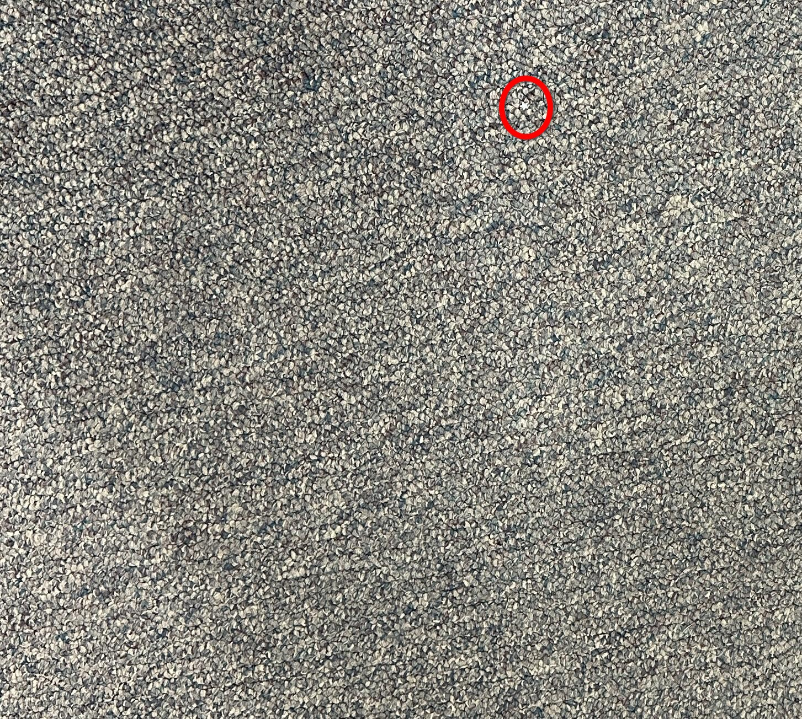

+++
title = '#20'
date = 2026-01-20T00:00:00-05:00
draft = false
+++
## 🔎 Find the dog! 🐶
<!--more-->

<b>

<!-- description -->
<!-- /description -->

---

  

    ❓ Hints
  

<!-- hints -->
- you can only see the dog's head
<!-- /hints -->

---

  

     🎯 Location for #19
  

  

</b>

---
