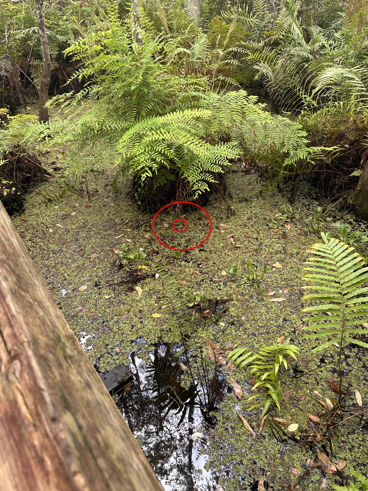

+++
title = '#23'
date = 2026-01-23T00:00:00-05:00
draft = false
+++
## 🔎 Armadillo on the move 🏜️
<!--more-->

<b>

<!-- description -->
### Fun(?) Fact:
> Armadillos are among the few known species that can contract leprosy systemically. They are particularly susceptible due to their unusually low body temperature, which is hospitable to the leprosy bacterium.

<!-- /description -->

---

  

    ❓ Hints
  

<!-- hints -->
- ↪️🪾
<!-- /hints -->

---

  

     🎯 Location for #22
  

  

</b>

---
