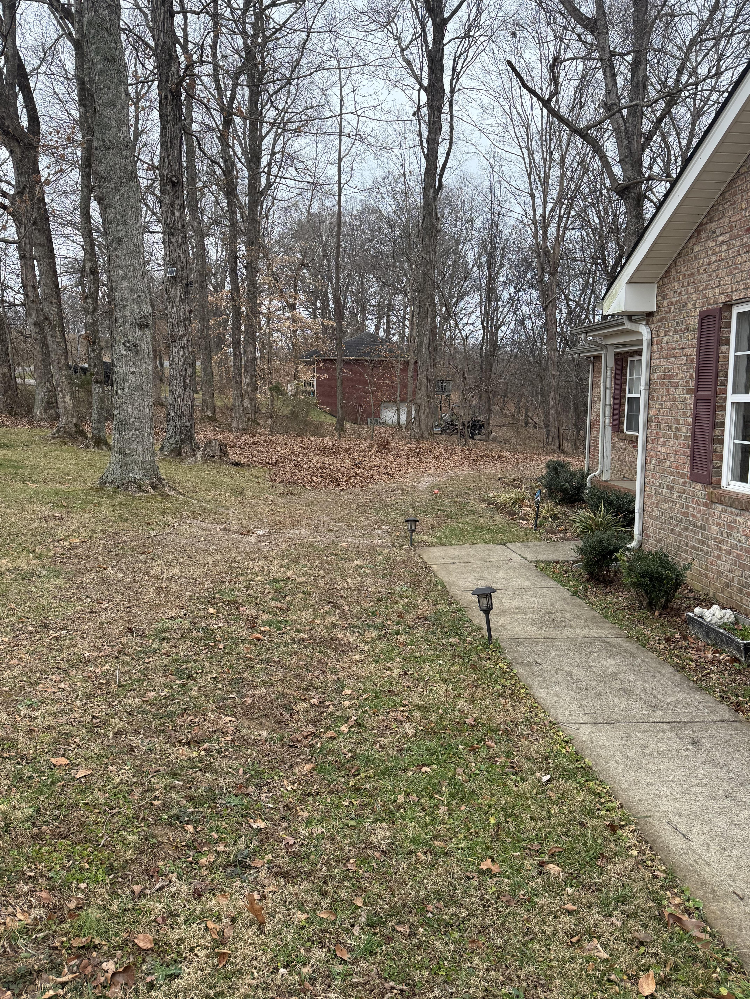
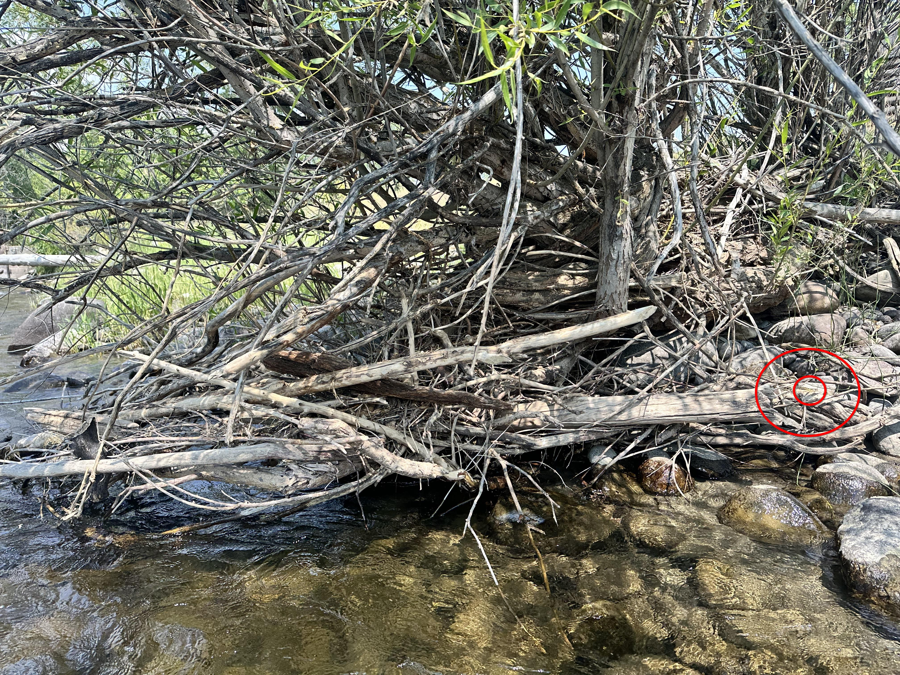

+++
title = '#4'
date = 2026-01-04T00:00:00-05:00
draft = false
+++
## 🔎 Critter
<!--more-->

<b>

<!-- description -->
<!-- /description -->

---

  

    ❓ Hints
  

<!-- hints -->
   - 🍂
<!-- /hints -->

---

  

     🎯 Location for #3
  

  

</b>

---
