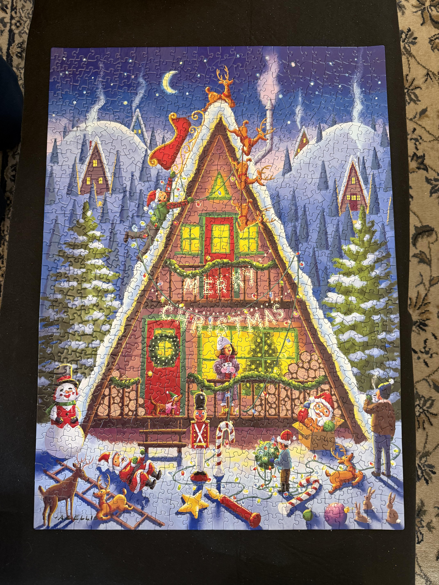
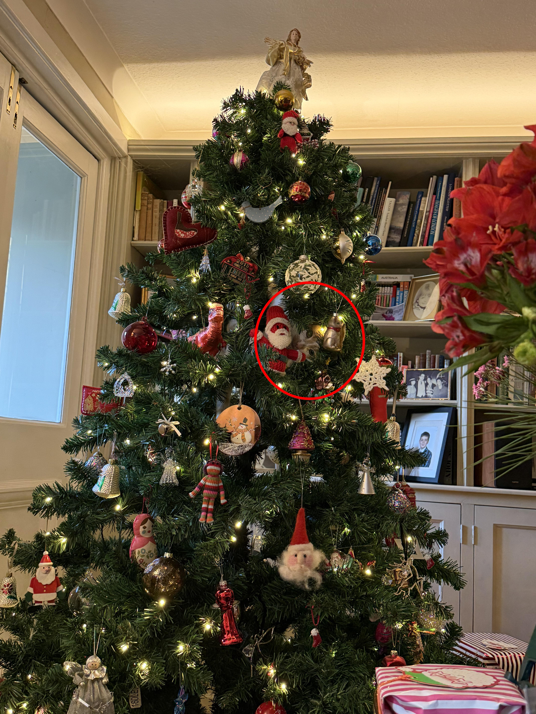

+++
title = '#3'
date = 2026-01-03T00:00:00-05:00
draft = false
+++
## 🔎 Extra puzzle piece 🧩
<!--more-->

<b>

<!-- description -->
There's an extra, duplicate puzzle piece in this picture.
<!-- /description -->

---

  

     🎯 Location for #2
  

  

</b>

---
